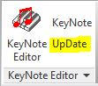
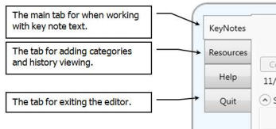
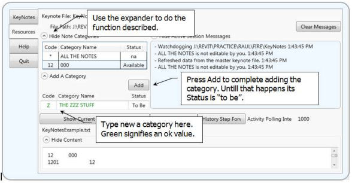
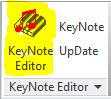

# WpfRevituserKeynoteManager is a KeyNote Editor

- 	The WpfRevituserKeynoteManager is for editing a Revit Userkeynote table files. It allows more than one person at a time to edit keynotes at the same time provided they are each editing different keynote categories.

- 	The editor notifies each user working within the same table as to what each user is doing. When someone commits an edit, the table is automatically reloaded at every user.

- 	Updating the table in Revit is still up to the user to initiate using a Revit add-in that places a conveinent update button on the Revit ribbon.




- This repository does not currently contain that Revit add-in (1/9/2018).

- The editor also saves and displays all previous keynote file versions.

#### Some quick notes for those interested in the coding
- The multiple simultaneous editing is accomplished using temporary user status files at the keynote table file folder and a background thread that constantly polls the keynote table file folder for changes.
- The editor runs in single instance mode. That means it checks to see if there is already an instance running. This avoids more than one instance running, which would be problem. The editor is designed to be launched in Revit with an add-in that appends the Revit project userkeynote table file name as a command argument. Thus the same user editing the same table on the same machine is avoided.
- A borderless, transparent WPF window is how the application's look achieved.

## The Parts

The following image shows the editor.


Resize the editor from the lower right corner. Move it by dragging it from anywhere except an editable control. The editor remembers where you last moved and sized it.

The tabs on the left are for the typical tasks.




The KeyNotes tab is where you perform the editing.


In the typical workflow, you first select the notes category to view. The notes listed will only be the notes in that category. You can make changes, but reserve the category first. Reserving a category prevents anyone else using this editor from editing that category while you have it reserved.

Committing a change writes the changes out to the keynote file. The changed keynote file table is automatically detected and reloaded with the new changes. The reload happens to all others using the editor. Committing does not un-reserve, i.e. “Give Up”, the category. The older file version is saved to a history folder during the commit process.

The keynote table file can automatically reload, and therefore change, at any time when others are editing the same keynote table file. In other words in your edit session all notes except for those in the reserved category can spontaneously change any time when others are editing the same keynote table file.  For that reason it is important to reserve the note category prior to starting an edit.

The message windows lets you know what is going on and what others are doing. Messages are listed in chronological order with the more recent messages at the top.

Adding categories is explained later in this document.


The Reserve button changes to a Give Up button when you have reserved a note category. Only one category can be reserved at a time to allow others to reserve a different category for their editing.

The note text edit box is where you edit. Double clicking a note in the table sends the focus to the text edit box. Green text in the note edit box means you have the category reserved.  Red text means you do not have the category reserved. All edits in the edit box should be instantly reflected in the notes list below it.

You can drag notes from Word into the note edit box. You can also cut and paste into it.

The Setting area is where to select the category from the Category Selector. It is also where notes can be found by text searching. Simple text replacing can also be performed.

In this next image, all notes containing the text “brace” are shown. The “WRD” button toggles the search between whole word or partial word. Notes from different categories are displayed in this image because “All The Notes” instead of a single category is selected.


Adding a new note and adding to a blank existing note are different tasks.

Adding a new note is accomplished with the Add Note button. It adds a new note numbered one higher than the last note in the selected category when there are no missing note numbers. It adds the first missing note number if there happens to be one. Keynote numbering is explained later in this document.

In this next image, the “Add T Note” button adds an empty T04 note because T04 would be the next NEW note.

Adding to a blank existing note is an edit task. The same image below shows the T02 note as the currently selected note.  The “Edit Note T02 Content Here” text above the note editing box reveals this. Text added to the edit box instantly shows in the list’s Note Content column for note T02. Something is wrong if the list does not instantly update.


## KeyNote Numbering


New  KeyNotes are numbered using three parts:

```
<The Category Code Part> + <Some Static Text Part> + <A Formatted Number Part>
```
For example in the Key “E05” the three parts are:

```
E + no static text + 05
```
E is the Category Code. The static text part is blank. The number part is the value 5 using the format “00”.

The increment value is what is added to the number part for the next new number. The next new number is a formatted number greater than the previous formatted number. If the increment is less an 1, say 0.1, then the next new number will always be a value of 1 larger than the previous number because the formatting resolution is an integer instead of a fraction. The editor will warn you when it looks like the number format and the increment format may not work the way you intend.

Example:
```
<The Category Code Part> = “E”
<Some Static Text Part> = “-10”
<The Number Format> = “000.01”
<Increment Value> = 0.1
```

New KeyNotes would look like:

```
E-10000.01
E-10000.02
E-10000.03
E-10000.04
```
## Adding Categories

Adding categories can be done on the Resources tab.

**Perform a commit as soon as possible after adding categories.** Unlike unreserved edits, all the new categories recently added are part of the next commit regardless of which category is reserved for the next commit. The resulting automatic reload that follows every commit, which happens to you and to other users, will contain the new categories.



## Viewing Edit History

Viewing edit history is for reference purposes. It happens on the Resources tab. Viewing the prior edit states does not revert the keynote table file to a previous state.

The Current File Contents, Step Back and the Step Forward buttons display the current central userkeynote table file and any saved prior versions.

History files are saved with a time stamp in the file name.


The editor’s History features shows you how many history files are present in the history folder. The editor creates the history folder during the first commit. After a while you might want to delete some of the older history files that would not be useful to keep. The “History Has xx Files” button opens the history folder in the Windows Explorer where you can then delete the unneeded prior keynote table files.

## Starting from Scratch

Starting from scratch means there is not a user KeyNote table text file and therefore the Revit project does not have such a file set as its UserKeyNote table file.

The Revit project needs to be a workshared file.

Click on the KeyNote Editor icon in the Revit ribbon. (This add-in for this is not currently included in this repository. Sorry.)



The KeyNote editor will launch and immediately show a Windows file open dialog box asking for the KeyNote text file to open because the active Revit project does not have a userkeynote table file assignment.

*Note: The KeyNote command in the Revit ribbon add-in launches the keynote manager application with the keynote table file's folder and filename as application arguments to the keynote manager application. That is how the keynote manager application knows what table file to open. The keynote manager application assumes you want to browse to a table file when the arguments are missing or are in error some way.*

Navigate to the folder holding the Revit project’s central file, **not the local file’s folder**.  Right click in the folder to add a new folder. Name that folder “**KeyNotes**”. The Windows file open dialog allows this type of activity.

Navigate into the new folder “**KeyNotes**”. Right click again the folder and select New Text Document in the resulting popup menu. Correctly name that file YourCorrectName_Keyed_Notes.txt where the “YourCorrectName” is the appropriate name.

Finish by selecting that file as the keynote table file for the KeyNote editor to open.

This keynote table file will be empty of categories and notes to go with the categories. Add the categories as needed using the methods described above.

Select any one of the new categories to reserve and then commit. The keynote table file will now be ready for editing.

At this point Revit knows nothing about this userkeynote table file. In Revit select userkeynote settings in the Revit ribbon. Set the userkeynote table file in the settings. You will be browsing to the KeyNotes folder and selecting the \*.txt file you just made. When you do this, you might notice there is a new folder in KeyNotes named “History”. The KeyNote editor named that folder when you first committed. Another folder beyond it holds the saved historical userkeynote table files

Revit will have loaded the file you selected. Save and sync the Revit project file.

Close out the KeyNote Editor by selecting the Quit Tab. Again, click on the KeyNote Editor icon in the Revit ribbon. The KeyNote Editor should now launch and have the proper KeyNote table file loaded.

## About Revit User KeyNotes and why this tool does what it does and why it does not do certain things.

A Revit **User KeyNote** is a special tag type family instance that "tags" model objects only with annotation showing a key value, like a number for example. That key value is associated to some text. The associated text and its key value is maintained in a “**Keynote Table**” text file outside of and therefore separate from the Revit file.

The “**Keynote Table**” text filename is set in settings for UserKeyNotes. Revit allows only one such file set to a Revit project.

Keep in mind all Revit tags apply to model objects only. You cannot use them in detail views or use them to tag a detail or annotation class object mixed in with model objects in a plan view.   

There are two reasons for the keynote editor. The keynote table is a separate file from the Revit project file and Revit does not provide a way to edit the table. One can edit the keynote table with any text editor, but the keynote table is easily damaged if one does not understand or follow the strict keynote table file structure. No ordinary text editor is designed to organize the note editing tasks for how the table is used in Revit. Furthermore, shared editing is not a feature in a typical text editor.

The format for a typical note line in that **Keynote Table** is:

```
<the key value>  <tab>  <the associated text>  <tab>  <the organizing code>
```

An example in this format is:

```
F02 <tab> PROVIDE STANDPIPE SYSTEM FOR THIS STAIRWELL <tab> F
```

In the next image you see the above example note in the Revit key value selection interface when the <organizing code> “F” has been also defined in the **Keynote Table** to be “FIRE PROTECTION”.


Revit does not show the organizing code after the text content. That code tells Revit how to show the note hierarchy. In this case the F tells Revit to show the note in the F FIRE PROTECTION grouping.


The format for defining the organizing codes in that **Keynote Table** is:

```
<the organizing code>   <tab>   <the associated organizing text>
```

An example in this format is:

```
F  <tab>  FIRE PROTECTION
```
The Keynote editor uses the name “Category” when referring to the organizing structure.

There is no occurrence order required for the  keynote text lines and the category organizing code definitions within the Keynote Table text file. It can be totally random. Revit sorts the data prior to showing it in the key value selection interface.

The Keynote editor displays the categories in alphabetical order. It writes the Keynote Table text file with the categories listed first followed by the keynotes.

The most recently reserved category definition is always written first. The keynotes for that category are always written last in their numerical order. The table’s information in between is written in the order it was in the previously saved table file.

In Revit these User KeyNote tags can then be shown in a special Revit "Legend" placed on drawing sheets. The legend shows the key value next to the text. In loose layman's terms this is "keyed notes on a drawing sheet".

In Revit where every item must be understood in terms of its specific Revit object name, we are dealing with User KeyNotes, being a special family annotation class having a key value associated to a line of text where that text is saved in a separate file. The legend is a special legend class meant for showing user keynote information.

The Revit "Legend" is similar to a Revit "Schedule" except for one very important difference. Unlike a Revit Schedule, one single Revit User KeyNote Legend can automatically show only the User KeyNotes visible on the sheet instead of all the User KeyNotes in the Revit file. A regular Revit Schedule is not intended for that purpose.

Yes, you can fake this behavior with a Revit Schedule, but doing so requires a different custom Schedule for each sheet and then layers of custom family features you maintain in each keynote instance for filters in the custom Schedules to show only certain notes.

With Revit User KeyNotes you select a model object the keynote will point to. This is "hosting". You then select the keynote "number" that is associated to the text that you want Revit to show in the User KeyNote Legend. Revit gets the key number and the text from the external User KeyNote table text file.

The advantage to hosting is that the note follows the host around and the note disappears when the host is deleted. The disadvantage to hosting is that the note follows the host around and the note disappears when the host is deleted.

Revit retains the information is read from the last time it read the User KeyNote table text file. It re-reads the file every time you open the project Revit file and it can be commanded to reread the file during a Revit session. All previously read User KeyNote table data will be retained in a Revit project when Revit cannot find the table data file to read. All previously assigned key values not found in subsequent table data files

Revit does not automatically update from a changed User KeyNote table text file. It does tell you when plotting when the table file on disk has a newer date than the last time it read the table file.

Revit keynote legends in the views browser display all the user keynotes placed in the project according to the legend’s filters. Legends placed on a sheet can show only those user keynotes visible in the other views placed on that same sheet. Alternatively, it can also show all the user keynotes placed in the project. In both cases the legend’s display filters apply.

The control for sheet only versus all in project display is not a legend setting. It is a user keynote setting.   

The text associated to a User KeyNote is from the external User KeyNote text file. The ONLY two things Revit knows for sure about a User KeyNote is the "key value", i.e. the note number AND the name of the single User KeyNote file associated with the Revit file.

Revit uses those two pieces to extract the note's text from the external file. It does this when the project loads and every time you reload the User KeyNote text file. The Revit project file remembers the last retrieved text for each key value in case the User KeyNote text file is not found again.

When it comes time again for Revit to read that external text file, Revit is not looking for the text to find the number ("key value"). It instead uses the key number to find the associated text in the User KeyNote file.
The analogy to lock key is a way to think about this. The “key value” is like a labeled room key for a hotel where the labeled room keys open the hotel room having the same number as on the key on its door. Inside each room is the keynote text.

Hotel room numbers do not change. Think what happens if you were to change the numbers in the external User KeyNote text file. That would be like changing the room numbers on the room doors in a hotel. The room keys already handed out could open a different room, because they work that in this odd hotel, and therefore the wrong keynote text is collected.

This User KeyNote manager tool does not have features to renumber or delete notes. When the keynote table keys are renumbered and when table keys are deleted, then the next time Revit reads the keynote table the notes that were renumbered would show the wrong text and the notes that were deleted would show a question mark.

Revit User KeyNotes has a way to divide user keynotes into different categories. The Revit User KeyNote selector user interface separates the selections. Thus, you can categorize keynotes by disciplines Electrical, Mechanical and Plumbing etc.

Because there can be only one external Revit User KeyNote file, multiple Revit users must wait their turn to edit the single external User KeyNote file. This KeyNote editor application allows multiple Revit users to edit the User KeyNote file as long as they are editing different categories. That is what "reserving" a category is about. Users "reserve" a category when they want to make an edit.

Reserving a category causes others using the KeyNote editor application to be locked out of editing a category while you edit and subsequently "commit" your changes before giving up the category for other to be able to edit.

The KeyNote editor application session messages informs what other users are doing. The KeyNote editor constantly monitors the keynote table file’s folder for activity. User activity is conveyed through \*.RKU (“Revit Keynote User”) text files created, changed and deleted by the KeyNote editor during its normal operations.

When you "commit" a category with the KeyNote editor you are actually recreating the external User KeyNote text file with changes made only to the category you have reserved. A copy of the original external User KeyNote text file is filed away into a "History" folder just prior to that file recreation. Therefore, prior versions of the external User KeyNote file are maintained in case needed. The saved prior versions are saved with timestamps added to their file names.

The KeyNote editor application knows when you and others have made changes to the User KeyNote file. It tells you when the file is new. It also automatically reloads the new User KeyNote file back into itself but it does not automatically reload the User KeyNote file into Revit.

A Revit reload causes Revit to repopulate its keynote database and its impact on views. It takes too long to have an automatic reload be of use. It is up to you to use the KeyNote editor ribbon command for reloading and to use the KeyNote editor reload button.

The file format for the Revit User KeyNote text file is actually very simple. It is simple enough for someone to use a Text editor to make easy whole line changes like removing categories. However, it would be tedious to create and edit notes on an individual basis. One simple format mistake can mess up the table text file.

Removing an entire category is an edit best left to editing the User KeyNote table text file directly in a Text editor because it involves deleting whole lines only.

The Revit ribbon command that runs the KeyNote editor application assumes the current Revit project file is workshared. It uses the workshared file's central file path as the starting point for discovering the User KeyNotes file in a folder "KeyNotes". The keynotes file should be named to end in "\_Keyed_Notes.txt". The file name for any single discovered file is passed to the KeyNote editor application to open upon startup.

### Therefore:

- The Revit file should be workshared if the ribbon's KeyNote editor application launcher is expected to work as designed.
- The User KeyNotes file should be named to end in "\_Keyed_Notes".
- The User KeyNotes file should be in folder named "KeyNotes" residing in the central file's folder.

The KeyNote editor application saves copies of all KeyNoteFile saved states at a folder "/KeyNotes/History/PriorKeynoteFiles" it creates. The "Step Back" and "Step Forward" feature shows the historical files. You can cut and paste to retrieve prior information.

Revit actually tolerates any order in the Revit User KeyNote text file. The typical User KeyNote text file convention writes the categories first followed by the keynotes for the categories. The KeyNote editor application follows the convention, but places the "reserved" category as the first category listed. However, the notes for the reserved category, i.e. the most recently changed category, are written at the end of the User KeyNote text file.

The KeyNote editor is designed to be a “single instance windows presentation foundation application”. In other words, it does not allow a second instance of itself to run. It actually does this by checking to see if itself is one of more than one instance running. It closes itself out if that is the case.

This means that if something crazy happens in Windows resulting in a zombie KeyNote editor running, i.e. the KeyNote editor running with no visibility, then the KeyNote editor will never run no matter how hard you click to launch it. (It does run but closes itself before you see it.) Restarting Windows would resolve this condition.

## The KeyNote Revit Ribbon Add-in

This is a placeholder for explaining the KeyNote Revit Ribbon Add-in.


