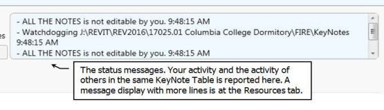

#WpfRevituserKeynoteManager is a KeyNote Editor

- 	The WpfRevituserKeynoteManager is for editing a Revit Userkeynote table files. It allows more than one person at a time to edit keynotes at the same time provided they are each editing different keynote categories.

- 	The editor notifies each user working within the same table as to what each user is doing. When someone commits an edit, the table is automatically reloaded at every user.

- 	Updating the table in Revit is still up to the user to initiate using a Revit add-in that places a conveinent update button on the Revit ribbon.


- This repository does not currently contain that Revit add-in (1/9/2018).

- 	The editor also saves and displays all previous keynote file versions.


##The Parts

The following image shows the editor.


Resize the editor from the lower right corner. Move it by dragging it from anywhere except an editable control. The editor remembers where you last moved and sized it.

The tabs on the left are for the typical tasks.


The KeyNotes tab is where you perform the editing.


In the typical workflow, you first select the notes category to view. The notes listed will only be the notes in that category. You can make changes, but reserve the category first. Reserving a category prevents anyone else using this editor from editing that category while you have it reserved.

Committing a change writes the changes out to the keynote file. The changed keynote file table is automatically detected and reloaded with the new changes. The reload happens to all others using the editor. Committing does not un-reserve, i.e. “Give Up”, the category. The older file version is saved to a history folder during the commit process.

The keynote table file can automatically reload, and therefore change, at any time when others are editing the same keynote table file. In other words in your edit session all notes except for those in the reserved category can spontaneously change any time when others are editing the same keynote table file.  For that reason it is important to reserve the note category prior to starting an edit.

The message windows lets you know what is going on and what others are doing. Messages are listed in chronological order with the more recent messages at the top.

Adding categories is explained later in this document.




The Reserve button changes to a Give Up button when you have reserved a note category. Only one category can be reserved at a time to allow others to reserve a different category for their editing.

The note text edit box is where you edit. Double clicking a note in the table sends the focus to the text edit box. Green text in the note edit box means you have the category reserved.  Red text means you do not have the category reserved. All edits in the edit box should be instantly reflected in the notes list below it.

You can drag notes from Word into the note edit box. You can also cut and paste into it.

The Setting area is where to select the category from the Category Selector. It is also where notes can be found by text searching. Simple text replacing can also be performed.

In this next image, all notes containing the text “brace” are shown. The “WRD” button toggles the search between whole word or partial word. Notes from different categories are displayed in this image because “All The Notes” instead of a single category is selected.


Adding a new note and adding to a blank existing note are different tasks.

Adding a new note is accomplished with the Add Note button. It adds a new note numbered one higher than the last note in the selected category when there are no missing note numbers. It adds the first missing note number if there happens to be one. Keynote numbering is explained later in this document.

In this next image, the “Add T Note” button adds an empty T04 note because T04 would be the next NEW note.

Adding to a blank existing note is an edit task. The same image below shows the T02 note as the currently selected note.  The “Edit Note T02 Content Here” text above the note editing box reveals this. Text added to the edit box instantly shows in the list’s Note Content column for note T02. Something is wrong if the list does not instantly update.


##KeyNote Numbering


New  KeyNotes are numbered using three parts:

```
<The Category Code Part> + <Some Static Text Part> + <A Formatted Number Part>
```
For example in the Key “E05” the three parts are:

```
E + no static text + 05
```
E is the Category Code. The static text part is blank. The number part is the value 5 using the format “00”.

The increment value is what is added to the number part for the next new number. The next new number is a formatted number greater than the previous formatted number. If the increment is less an 1, say 0.1, then the next new number will always be a value of 1 larger than the previous number because the formatting resolution is an integer instead of a fraction. The editor will warn you when it looks like the number format and the increment format may not work the way you intend.

Example:
```
<The Category Code Part> = “E”
<Some Static Text Part> = “-10”
<The Number Format> = “000.01”
<Increment Value> = 0.1
```

New KeyNotes would look like:

```
E-10000.01
E-10000.02
E-10000.03
E-10000.04
```
##Adding Categories

Adding categories can be done on the Resources tab.

**Perform a commit as soon as possible after adding categories.** Unlike unreserved edits, all the new categories recently added are part of the next commit regardless of which category is reserved for the next commit. The resulting automatic reload that follows every commit, which happens to you and to other users, will contain the new categories.


##Viewing Edit History

Viewing edit history is for reference purposes. It happens on the Resources tab. Viewing the prior edit states does not revert the keynote table file to a previous state.

The Current File Contents, Step Back and the Step Forward buttons display the current central userkeynote table file and any saved prior versions.

History files are saved with a time stamp in the file name.


(yet more)
